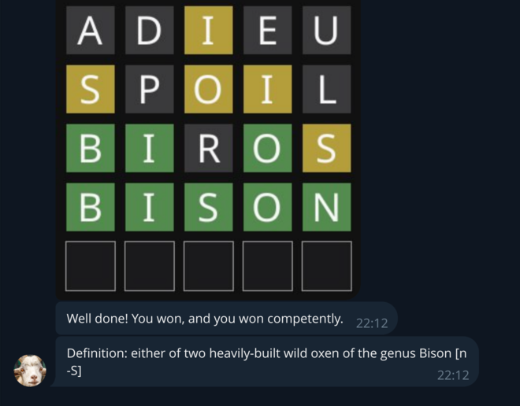
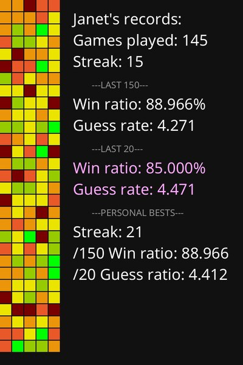

# Goat Rebirth

Simple framework to bring back goat but on telegram.

Implement "similar" classes for Message, Module etc etc so that there's some API similarity to at least some degree.

Then port some modules.

# Wordle Module

A simple wordle-like module which records extensive performance stats and can be played in a channel.

